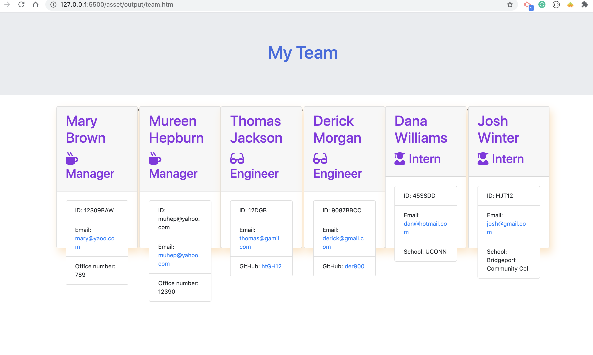
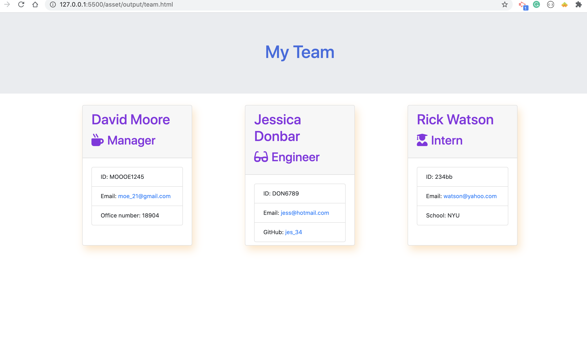
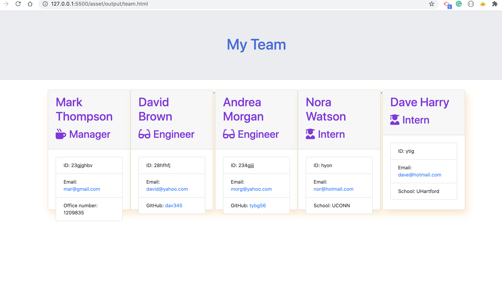

#  Project Title: Template-Engine Employee-Summary

## Badge: 

 

## User Story 

* As a manager, I want to generate a webpage that displays my team's basic infomation that give me quick access to their emails, school and GitHub data.

## Technology

- Nodejs
- Express
- JavaScript
- HTML/CSS

## Description: 

* Create a team generator command line application that will prompt the user for information about the team manager and team members. 
* The user can input any number of team members, and they may be a mix of engineers and interns. 
* Create and pass all unit tests. 
* When the user has completed building the team, the application will create an HTML file that displays a nicely formatted team roster based on the information provided by the user. 

## Table of Content: 

* [Installation](#installation)  
* [Usage](#usage)
* [License](#license)
* [Contributors](#contributors)
* [Tests](#tests)
* [Questions](#questions)

## Installaion:
* npm i

## License: 
* MIT
# Contributing: 
* Pull request and stars are always welcome.
## Testing: 
* npm jest

## Questions
If you have any questions, please contact at:   
Email: carolenesw@gmail.com

## link

* video link: 
https://drive.google.com/file/d/1jUJJcjkWLHgwm8__W8eCg4DR1TWlug2f/view?usp=sharing

* repo link:
https://github.com/Carolenesw/Template-Engine---Employee-Summary

## Images

